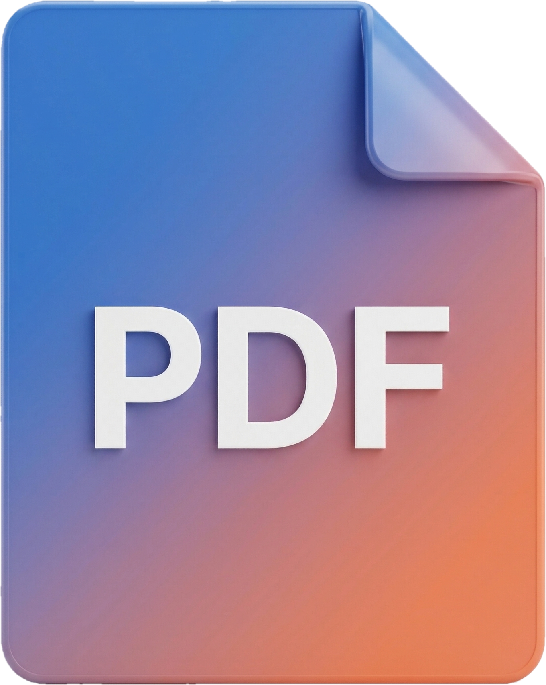
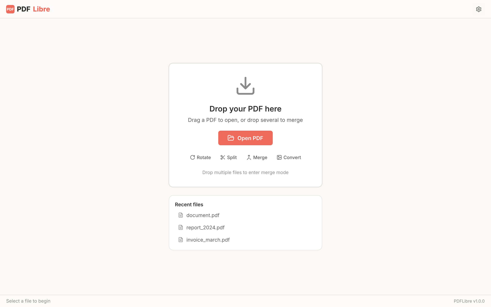
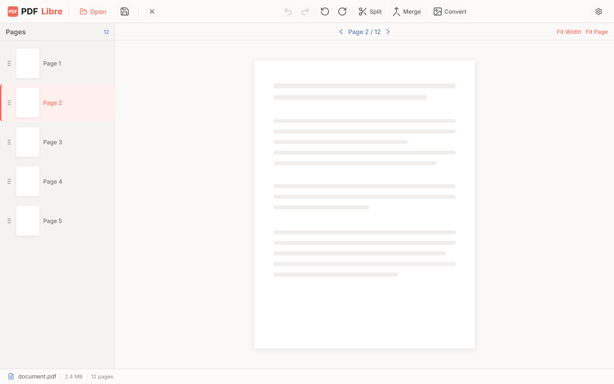
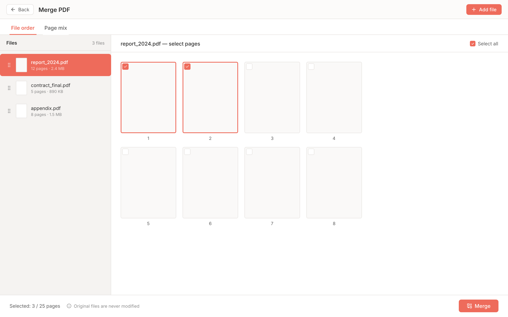
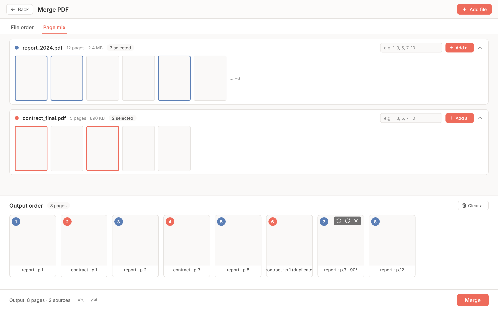

<p align="center">
  
</p>

<h1 align="center">PDFLibre</h1>

<p align="center">
  <strong>Free, open-source desktop PDF toolkit</strong><br/>
  무료 · 오픈소스 · 데스크톱 PDF 도구
</p>

<p align="center">
  
  
  
  
  
  
</p>

<p align="center">
  <em>Merge · Split · Convert · Rotate — everyday PDF tasks without the upsell.</em>
</p>

---

## What is PDFLibre?

PDFLibre is a **free, open-source desktop PDF toolkit** that handles the everyday operations paid PDF apps charge for: merging, splitting, converting pages to images, rotating, and rearranging pages across multiple files. It runs **entirely offline** — your files never leave your machine — and works on macOS, Windows, and Linux.

Think of it as an **Adobe Acrobat alternative** for the basics, without ads, without sign-ups, and without a paywall hiding common features.

### 한국어

PDF 하나 자르려고 검색하면 광고 범벅 웹사이트, 회원가입 요구하는 온라인 툴, "이 기능은 유료입니다" 띄우는 무거운 프로그램들… 이런 경험에 짜증이 나서 만들었습니다.

**변환 · 분할 · 병합 · 회전.** PDF를 다룰 때 실제로 필요한 기능을 하나의 가벼운 앱에 모았습니다. 무료이고, 오프라인으로 동작하며, 파일이 외부로 업로드되지 않습니다.

## Privacy First / 프라이버시 우선

- 🔒 **100% offline** — files are processed locally, never uploaded
- 🚫 **No telemetry, no analytics, no sign-up**
- ✅ **Open source (MIT)** — auditable, forkable, free forever

> 모든 처리는 로컬에서 수행. 외부 서버 전송·분석·계정 가입 일절 없음.

## Features

| Feature | Description | 설명 |
|---------|-------------|------|
| **PDF → Image** | Convert pages to JPEG, PNG, TIFF, BMP, or GIF with custom DPI and quality | 페이지를 이미지로 변환 (DPI/품질 조절) |
| **PDF Split** | Extract page ranges with intuitive syntax: `1-3, 5, 7-10` | 범위 문법으로 원하는 페이지 추출 |
| **PDF Merge** | Two modes: simple file-order merge, and advanced page-mix (combine pages from different PDFs in any order) | 단순 이어붙이기 + 페이지 혼합 모드 |
| **Page Rotation** | Rotate individual pages in 90° increments | 개별 페이지 90° 회전 |
| **Undo / Redo** | Free reversal of rotation and reorder operations | 회전·순서 변경 자유롭게 되돌리기 |
| **Drag & Drop** | Drop a PDF to open instantly; drop multiple to merge | 드래그&드롭으로 즉시 열기 / 다중 병합 |
| **Password Protection** | Open password-protected PDFs, add or remove a password (AES-256) — powered by bundled qpdf | 암호 PDF 열기 · 암호 설정/제거 (AES-256) |
| **Dark Mode** | System-aware light/dark theme | 시스템 연동 라이트/다크 |
| **i18n** | Korean & English with runtime switching | 한국어 / English 런타임 전환 |

## How does it compare?

| | PDFLibre | Adobe Acrobat | Smallpdf / ILovePDF |
|---|:---:|:---:|:---:|
| Free for all features | ✅ | ❌ (Pro $14.99/mo) | ❌ (limited free tier) |
| Offline / no upload | ✅ | ✅ | ❌ |
| Open source | ✅ MIT | ❌ | ❌ |
| macOS / Windows / Linux | ✅ All three | ✅ Mac/Win | Browser only |
| Page-mix from multiple PDFs | ✅ | ✅ | ❌ / Limited |
| File size | < 100 MB | ~3 GB | N/A |

## Screenshots

<p align="center">
  <br/>
  <em>Empty state — drop a PDF, or pick a quick action. <br/>시작 화면 — PDF를 끌어다 놓거나 빠른 작업을 선택.</em>
</p>

<p align="center">
  <br/>
  <em>Main viewer — page list, navigation, and quick access to split / merge / convert. <br/>뷰어 화면 — 페이지 목록 · 이동 · 분할/병합/변환 단축 진입.</em>
</p>

<p align="center">
  <br/>
  <em>Merge / File-order — pick files, choose which pages to include from each. <br/>병합 / 파일 순서 — 파일 단위로 묶고, 파일별 페이지를 선택.</em>
</p>

<p align="center">
  <br/>
  <em>Merge / Page-mix — assemble pages from multiple PDFs into any order, with rotation and undo/redo. <br/>병합 / 페이지 혼합 — 여러 PDF의 페이지를 자유 순서로 조합, 회전·되돌리기 지원.</em>
</p>

## Status

- ✅ **v1.0 (current)**: Convert, Split, Merge (file-order + page-mix), Rotate, Undo/Redo, Drag & Drop, Dark mode, i18n
- 🚧 **Next**: Drag-from-tray to output canvas, large-file performance tuning, virtualization, more E2E tests
- 🗓 **Later**: Compression, OCR, batch processing — not in scope yet
- 📱 **Mobile (iOS / Android)**: planned after the desktop release stabilizes / 데스크톱 안정화 이후 모바일 지원 계획

### Platform support

| Platform | Build | Tested |
|---|:---:|:---:|
| macOS 11+ | ✅ | ✅ |
| Windows 10+ | ✅ | ✅ |
| Linux (Ubuntu 20.04+) | ✅ | ✅ |

> Verified on macOS, Windows, and Linux. Bug reports on any platform are welcome.
>
> macOS · Windows · Linux 모두 동작 확인됨. 어떤 플랫폼이든 버그 리포트 환영.

이 프로젝트는 활발히 개발 중입니다. Issue · PR 환영합니다.

## Install

### Requirements

- macOS 11+
- Windows 10+
- Ubuntu 20.04+ (or other modern Linux)

### Download

Pre-built binaries on the [Releases](https://github.com/justperson94/PDFLibre/releases) page.

### Linux

Three formats are published per release — pick whichever fits your distro:

- **AppImage** — no install needed. Download, mark executable, run.
  ```bash
  chmod +x PDFLibre-*-x86_64.AppImage
  ./PDFLibre-*-x86_64.AppImage
  ```
- **.deb** — Debian / Ubuntu / Mint / Pop!_OS. Integrates with the desktop menu.
  ```bash
  sudo dpkg -i pdflibre_*_amd64.deb
  ```
- **tar.gz** — portable bundle for servers or scripted setups. Extract and run `./pdflibre`.

> 리눅스는 세 가지 형태로 배포합니다 — AppImage(설치 없이 즉시 실행), .deb(Debian/Ubuntu 계열 시스템 통합 설치), tar.gz(이식 가능 번들).

### First-run on macOS

The app is **not signed with an Apple Developer ID yet** (planned for a later release). On first launch macOS Gatekeeper will block it with a *"cannot verify… may contain malware"* dialog. The app is safe — this is just Apple's default policy for unsigned apps.

**Two ways to allow it:**

**A. System Settings (recommended)**
1. Click **Done** on the warning dialog (do not move to Trash)
2. Open **System Settings → Privacy & Security**, scroll down
3. Find the *"PDFLibre was blocked…"* notice → click **Open Anyway** → enter password
4. Subsequent launches work normally

**B. Terminal (one-liner)**
```bash
xattr -dr com.apple.quarantine /Applications/PDFLibre.app
```
Removes the download-quarantine flag so the app launches directly.

> **macOS Gatekeeper 안내** — 코드 서명·공증을 아직 적용하지 않아 첫 실행 시 *"악성 코드가 없음을 확인할 수 없습니다"* 경고가 뜹니다. 앱 자체는 안전하며 Apple의 기본 정책입니다. **시스템 설정 → 개인정보 보호 및 보안**에서 *그래도 열기*를 누르거나, 터미널에서 위 `xattr` 명령을 한 번 실행하면 됩니다.

### Build from source

```bash
git clone https://github.com/justperson94/PDFLibre.git
cd PDFLibre
flutter pub get

# Run in dev
flutter run -d macos     # or windows / linux

# Build release
flutter build macos      # or windows / linux
```

Requires [Flutter SDK](https://docs.flutter.dev/get-started/install) (stable channel).

## Principles

- **No-overwrite by default** — every conversion / split / merge writes a new file. Originals are never touched.
- **Offline by design** — no network calls, no telemetry, no upload. Files stay on your disk.
- **Free as in freedom** — every feature is free. No pro tier, no ads.

> 원본 보호 · 오프라인 처리 · 모든 기능 무료.

## Tech stack

- [Flutter](https://flutter.dev) (Dart) — single codebase across desktop platforms
- [pdfrx](https://pub.dev/packages/pdfrx) — PDF rendering & manipulation
- [Provider](https://pub.dev/packages/provider) — state management
- MIT licensed; pull requests welcome.

## Contributing

Bug reports and feature requests via [Issues](https://github.com/justperson94/PDFLibre/issues). Pull requests for code, translations, or documentation are appreciated.

기여 환영합니다. 한국어 issue / PR 모두 OK.

## License

[MIT](LICENSE) &copy; 2026 justperson94

---

<p align="center">
  Built because PDF tools shouldn't be a paywall.
</p>
